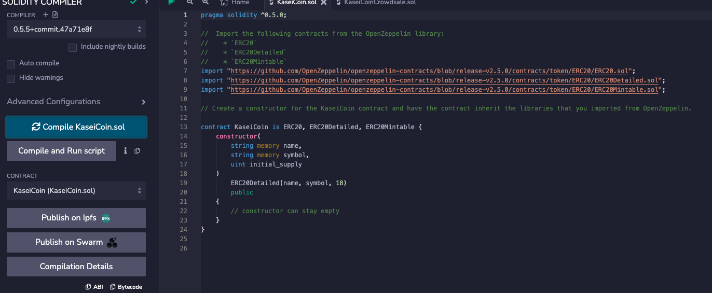

# Kasei Coin Token Crowdsale

This challenge creates a fungible token that is ERC-20 compliant and that is be minted by using a `Crowdsale` contract from the OpenZeppelin Solidity library.The crowdsale contract manages the entire crowdsale process, allowing users to send ether to the contract and in return receive KC, or KaseiCoin tokens. The contract mints the tokens automatically and distributes them to buyers in one transaction.


## Technologies

This project leverages the pragma solidity version 0.5.0 using the following technologies:

* [RemixIDE](https://remix.ethereum.org/) - The Remix Project is a rich toolset which can be used for the entire journey of contract development by users of any knowledge level, and as a learning lab for teaching and experimenting with Ethereum.

* [solidity](https://soliditylang.org/) - Solidity is an object-oriented programming language for implementing smart contracts on various blockchain platforms, most notably, Ethereum.

* [OpenZeppelin](https://docs.openzeppelin.com/contracts/4.x/) - A library for secure smart contract development. Build on a solid foundation of community-vetted code.Implementations of standards like ERC20 and ERC721.

* [MetaMask](https://metamask.io/)- MetaMask provides the simplest yet most secure way to connect to blockchain-based applications. You are always in control when interacting on the new decentralized web.

* [Ganache](https://trufflesuite.com/ganache/) - A program that allows you to quickly set up a local blockchain, which you can use to test and develop smart contracts.

## Installation Guide

Before running the application first install the following dependencies. Note that if you are running on the cloud and not locally you will have to run all lines of code.

You will need to set up a Ganache accout and run the quick start. Follow the instructions on the [RemixIDE](hhttps://remix.ethereum.org/) to get started and uplodad your notebok. Make sure to use the correct pragma of solidity to run the code and compile correctaly. 

```
pragma solidity ^0.5.0

```


---
## Evaluation Evidence 

### These are screenshot of the contracts sucessfull compiled. 




### Testing and Deploying

Here is metamask linked to Ganache account and you can see it has the ETH balance 

 


These are recording of the deployment and minting of the coins to different Ganache accounts. 


## Exaples

    ```solidity
    import "https://github.com/OpenZeppelin/openzeppelin-contracts/blob/release-v2.5.0/contracts/crowdsale/validation/CappedCrowdsale.sol";
    import "https://github.com/OpenZeppelin/openzeppelin-contracts/blob/release-v2.5.0/contracts/crowdsale/validation/TimedCrowdsale.sol";
    import "https://github.com/OpenZeppelin/openzeppelin-contracts/blob/release-v2.5.0/contracts/crowdsale/distribution/RefundablePostDeliveryCrowdsale.sol";
    ```

## Contributors

DU Starter Code
Terrence McCoy


---

## License

MIT
